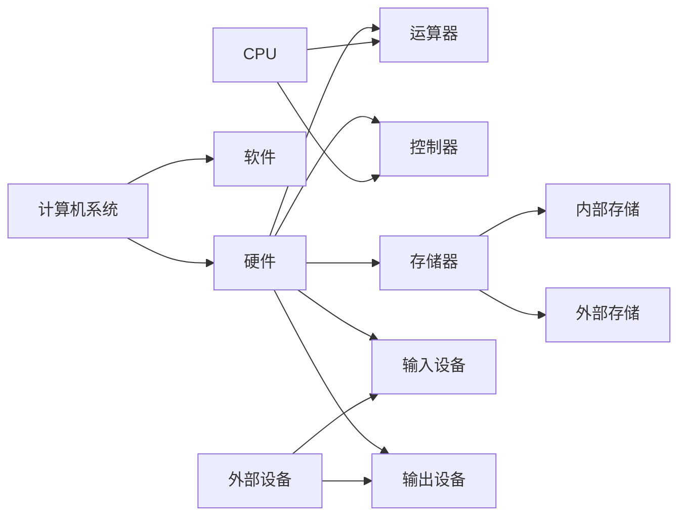
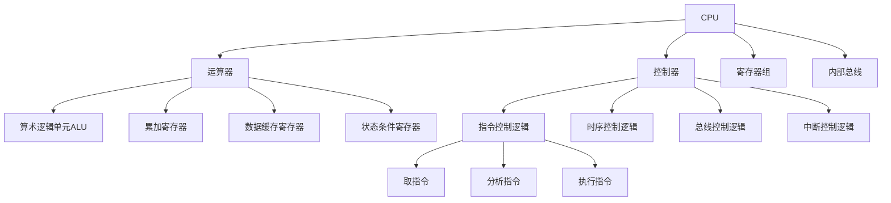

# 计算机系统基础知识

## 计算机系统硬件基本组成

- 算术逻辑单元ALU
  - 对数据的算术运算和逻辑运算
- 累加寄存器
  - ACU保存计算的结果
- 数据缓存寄存器
  - 存放内存指令、数据子，作为CPU和内存、外部设备之间数据传送的中转站；
  - 作为CPU和内存、外围设备之间在操作速度上的缓冲； 
  - 在单累加器结构的运算器中，数据缓存寄存器还可以兼作为操作数寄存器
- 状态条件寄存器
  - 状态标志、控制标志、运算结果仅为标志、运算结果一出标志、运算结果为0标志、运算结果为负标志、中断标志、方向标志、单步标志
